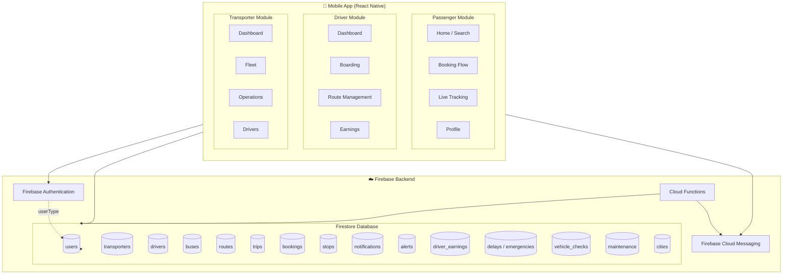
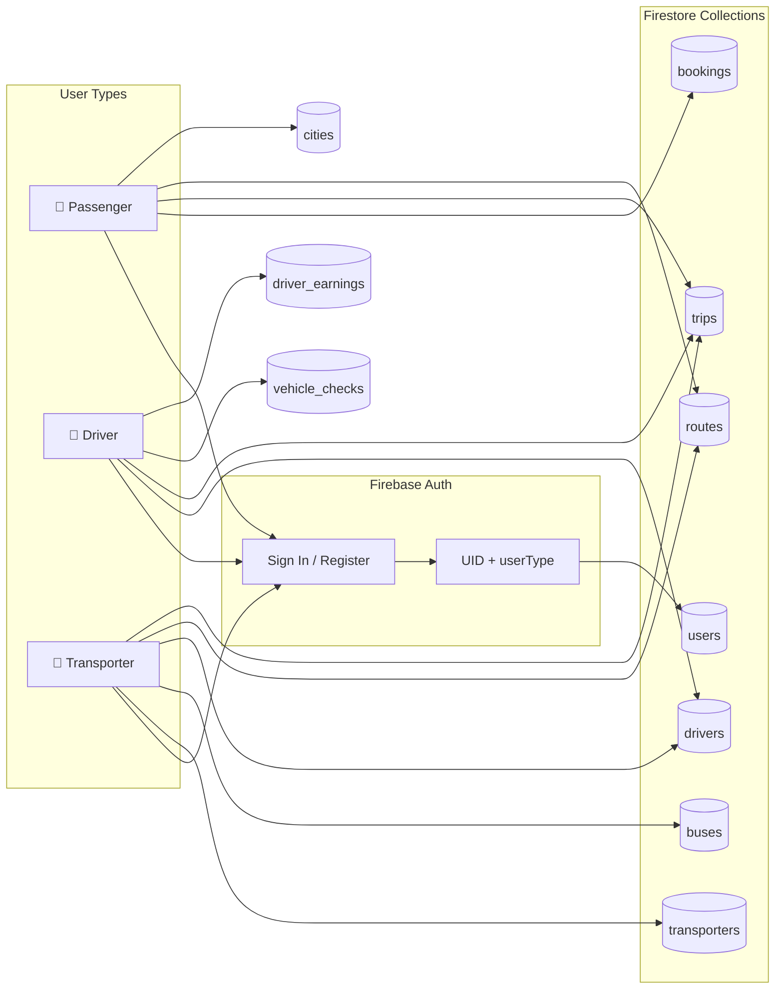
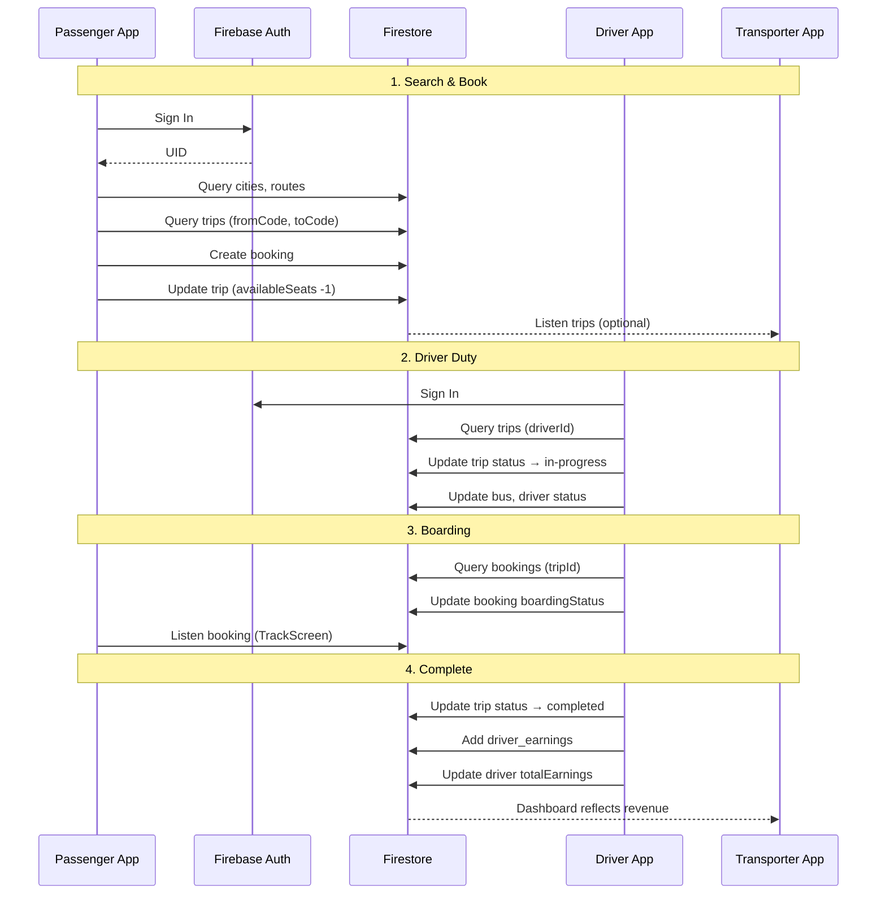
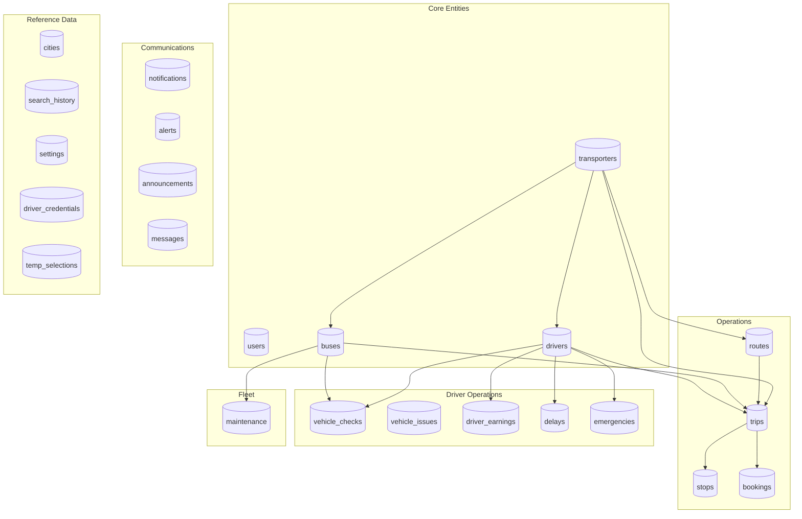

# ZuGo2 System Architecture Diagram

## High-Level Architecture



---

## Data Flow: User Types & Firebase Services



---

## Notification System Architecture

```mermaid
flowchart TB
    subgraph Mobile["Mobile App"]
        P[Passenger]
        D[Driver]
        T[Transporter]
    end

    subgraph FCMFlow["Push Notification Flow"]
        direction TB
        ReqPerm[Request Permission]
        GetToken[Get FCM Token]
        SaveToken[Save to Firestore]
        ReceiveMsg[Receive FCM Message]
    end

    subgraph FirestoreNotify["Firestore"]
        notif_col[(notifications)]
        drivers_col[(drivers)]
        announcements[(announcements)]
    end

    subgraph CF["Cloud Function"]
        OnAnnounce[onCreate: announcements]
        FetchTokens[Fetch driver fcmTokens]
        SendFCM[admin.messaging().sendMulticast]
    end

    D --> ReqPerm --> GetToken --> SaveToken
    SaveToken -->|fcmToken| drivers_col
    
    T -->|Create announcement| announcements
    announcements --> OnAnnounce
    OnAnnounce --> FetchTokens
    FetchTokens --> drivers_col
    FetchTokens --> SendFCM
    SendFCM -->|Push| D
    
    T -->|Create notification| notif_col
    D -->|Query notifications| notif_col
    P -->|Query notifications| notif_col
    
    ReceiveMsg --> D
```

---

## End-to-End Data Flow: Booking Journey



---

## Firestore Collections Map



---

## Cloud Functions (Current)

```mermaid
flowchart LR
    subgraph Trigger["Firestore Trigger"]
        A[announcements/{id}]
    end

    subgraph Function["sendAnnouncementNotification"]
        OnCreate[onCreate]
        Query[Query drivers where status=active]
        Tokens[Collect fcmTokens]
        Send[FCM sendMulticast]
    end

    subgraph Result["Result"]
        Push[Push to Driver Devices]
    end

    A -->|document created| OnCreate
    OnCreate --> Query
    Query --> Tokens
    Tokens --> Send
    Send --> Push
```

| Function | Trigger | Action |
|----------|---------|--------|
| `sendAnnouncementNotification` | `announcements` onCreate | Fetches active driver FCM tokens, sends multicast push notification |

---

## Component Summary

| Component | Technology | Purpose |
|-----------|------------|---------|
| **Mobile App** | React Native | Single codebase for Passenger, Driver, Transporter flows |
| **Firebase Auth** | Email/password, OTP | Identity; `userType` in `users` drives navigation |
| **Firestore** | NoSQL | Primary database; 23+ collections |
| **Cloud Messaging** | FCM | Push notifications (drivers store fcmToken) |
| **Cloud Functions** | Node.js | `sendAnnouncementNotification` on announcements |

---

## Data Flow Summary

| Flow | Source | Target | Data |
|------|--------|--------|------|
| **Passenger books** | Passenger App | Firestore | `bookings`, `trips` (seat count) |
| **Driver starts duty** | Driver App | Firestore | `trips`, `buses`, `drivers` status |
| **Driver boards** | Driver App | Firestore | `bookings` boardingStatus |
| **Transporter announces** | Transporter App | Firestore + FCM | `announcements`, `notifications` → FCM to drivers |
| **Delay/Emergency** | Driver App | Firestore | `delays`, `emergencies` |
| **Earnings** | Driver App (end duty) | Firestore | `driver_earnings`, `drivers`, `trips` |
